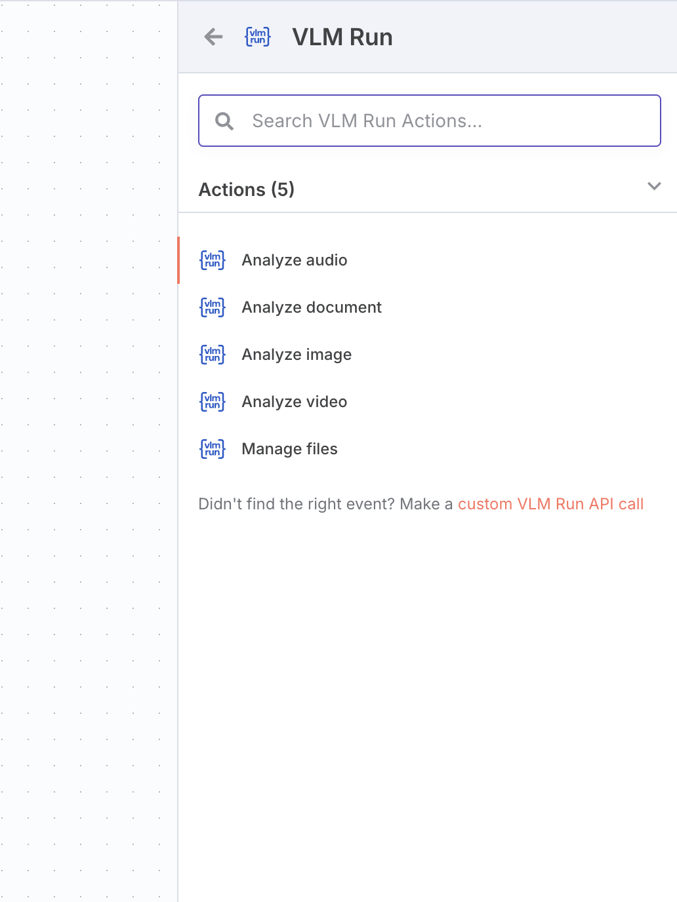
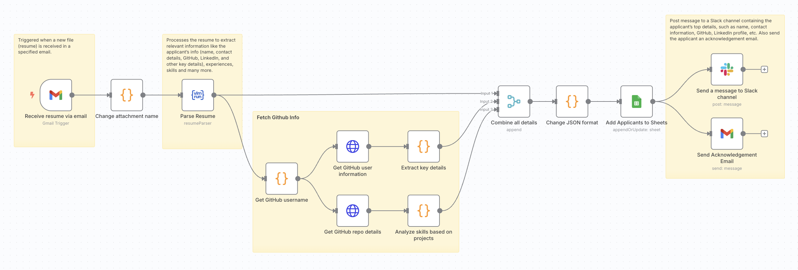

<div align="center">
<p align="center" style="width: 100%;">
    <br>
</p>
<h2>n8n-nodes-vlmrun</h2>
<p align="center">
<a href="https://vlm.run"><b>Website</b></a> | <a href="https://docs.vlm.run/"><b>Docs</b></a> | <a href="https://docs.vlm.run/blog"><b>Blog</b></a> | <a href="https://discord.gg/CCY8cYNC"><b>Discord</b></a>
</p>
<p align="center">
<a href="https://www.npmjs.com/package/@vlm-run/n8n-nodes-vlmrun"></a>
<a href="https://github.com/vlm-run/n8n-nodes-vlmrun/blob/main/LICENSE"></a>
<a href="https://discord.gg/4jgyECY4rq"></a>
<a href="https://twitter.com/vlmrun"></a>
</p>
</div>

This is an n8n community node. It lets you use [VLM Run](https://vlm.run) in your n8n workflows.

VLM Run is a unified gateway for Visual AI that enables you to extract structured data from unstructured visual content like images, videos, and documents using Vision Language Models (VLMs).

[n8n](https://n8n.io) is a [fair-code licensed](https://docs.n8n.io/reference/license/) workflow automation platform.

## 💾 Installation

Follow the [installation guide](https://docs.n8n.io/integrations/community-nodes/installation/) in the n8n community nodes documentation.

```bash
npm install n8n-nodes-vlmrun
```

## ⚙️ Operations

- **Extract Data**: Extract structured data from images using VLM Run's pre-defined schemas
- **Custom Schema**: Use your own custom schema to extract specific data from visual content
- **Process Documents**: Extract information from documents like invoices, IDs, and more
- **Visual ETL**: Integrate visual data extraction into your automated workflows

## 🔑 Credentials

1. Sign up for a VLM Run account at [vlm.run](https://vlm.run)
2. Get your API key from the dashboard
3. Use the API key in the n8n VLM Run node credentials

## 📦 Compatibility

- Requires n8n version 1.0.0 or later
- Node.js version 18 or later

## 📖 Usage

1. **Configure Credentials**:
   - Add your VLM Run API credentials in n8n
   - Set the API base URL (default: https://api.vlm.run/v1)

2. **Add VLM Run Node**:
   - Search for "VLM Run" in the n8n nodes panel
   - Add it to your workflow

3. **Configure Node**:
   - Select the operation (Extract Data, Custom Schema, etc.)
   - Provide the input image URL or file
   - Choose or define the schema for data extraction
   - Configure any additional parameters

## 📸 Screenshots

Here are some screenshots of the n8n-nodes-vlmrun in action:


*Overview of the VLM Run node in n8n*


*Example workflow using the VLM Run node*

## 🔗 Resources

- [n8n Community Nodes Documentation](https://docs.n8n.io/integrations/community-nodes/)
- [VLM Run Documentation](https://docs.vlm.run)
- [VLM Run API Reference](https://docs.vlm.run/api)
- [Example Workflows](https://n8n.io/workflows)

## 📝 Version History

### 0.1.5 (Current)
- Initial public release
- Basic VLM Run integration
- Support for pre-defined schemas
- Custom schema support
- Document processing capabilities

## 📄 License

[MIT](LICENSE)
